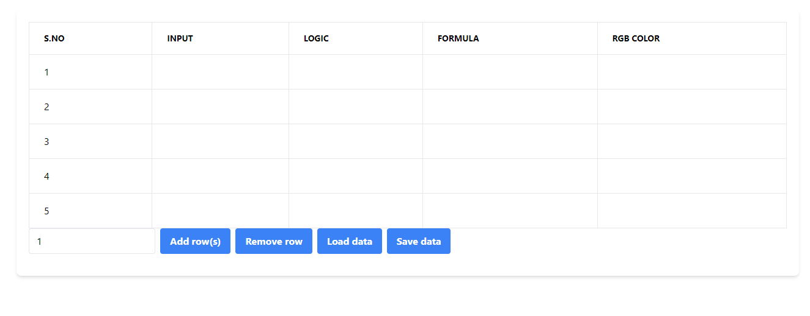

# React Spreadsheet

This is a simple spreadsheet application built using React and a Node.js backend.

## Features

- Add and remove rows
- Edit cell values by double-clicking on a cell
- Data is stored in a MongoDB database and can be manipulated using provided functions

## Installation

1. Clone this repository
2. Run `npm install` to install dependencies
3. Run `npm start` to start the development server
4. Set up the backend by following the instructions in the backend code

## Usage

- Use the "Add row(s)" button to add new rows to the spreadsheet. You can specify the number of rows to add using the input field next to the button.
- Use the "Remove row" button to remove the last row from the spreadsheet.
- Double-click on a cell to edit its value. Press enter or click outside the cell to save the changes.

## Technologies Used

- React
- React Hooks (useState, useContext, useMemo, useCallback)
- React Context
- Node.js
- Express
- Mongoose

## Output/Result

